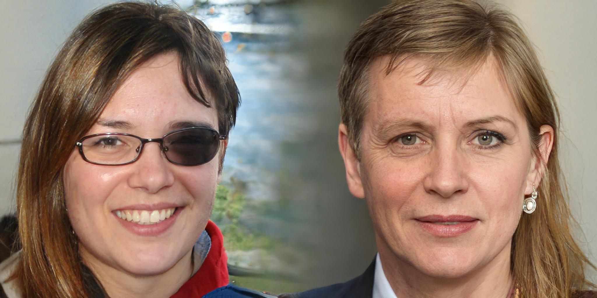

# StyleGAN2-ada for practice

<p align='center'></p>

[](https://colab.research.google.com/github/eps696/stylegan2ada/blob/master/StyleGAN2a_colab.ipynb)

This version of the PyTorch-based [StyleGAN2-ada] is intended mostly for fellow artists, who rarely look at scientific metrics, but rather need a working creative tool. 
Tested on Python 3.7\~3.8 + PyTorch 1.7\~1.10, requires [FFMPEG] for sequence-to-video conversions. For more explicit details refer to the original implementations. 

Here is previous [Tensorflow-based version], which produces compatible models (but not vice versa).  
I still prefer it for few-shot training (~100 imgs) on the older hardware.

## Features
* inference (image generation) in arbitrary resolution (finally with proper padding on both TF and Torch)
* **multi-latent inference** with split-frame or masked blending
* non-square aspect ratio support (auto-picked from dataset; resolution must be divisible by 2**n, such as 512x256, 1280x768, etc.)
* various conversion options (changing resolution/aspect, adding alpha channel, etc.) for pretrained models (for further finetuning)
* transparency (alpha channel) support (auto-picked from dataset)
* using plain image subfolders as conditional datasets 
* **upd:** adaptive pseudo augmentation from [DeceiveD] (on by default)
* funky "digression" inference technique, ported from [Aydao]

Few operation formats ::
* Windows batch-files, described below (if you're on Windows with powerful GPU)
* local Jupyter notebook (for non-Windows platforms)
* [Colab notebook] (max ease of use, requires Google drive)

Just in case, original [StyleGAN2-ada] charms:
* claimed to be up to 30% faster than original [StyleGAN2]
* has greatly improved training (requires 10+ times fewer samples than original [StyleGAN2])
* has lots of adjustable internal training settings
* works with plain image folders or zip archives (instead of custom datasets)
* should be easier to tweak/debug

## Presumed file structure

| stylegan2ada | root
| :--- | :----------
| &boxvr;&nbsp; **_in** | input data for generation (check examples there)
| &boxvr;&nbsp; **_out** | generation output (sequences, videos, projected latents)
| &boxvr;&nbsp; **data** | datasets for training
| &boxv;&nbsp; &boxvr;&nbsp; source | [example] folder with raw images
| &boxv;&nbsp; &boxvr;&nbsp; mydata(.zip) | [example] prepared dataset (folder with clean images or archive)
| &boxv;&nbsp; &boxur;&nbsp;  newdata | [example] another dataset
| &boxvr;&nbsp; **models** | trained networks for inference/generation
| &boxv;&nbsp; &boxur;&nbsp;  ffhq-1024.pkl | [example] trained network file (may contain Gs only)
| &boxvr;&nbsp; **src** | source code
| &boxur;&nbsp; **train** | training folders
| &ensp;&ensp; &boxvr;&nbsp;  ffhq-512.pkl | [example] pre-trained model file (full G/D/Gs)
| &ensp;&ensp; &boxvr;&nbsp;  000-mydata-512-.. | [example] auto-created training folder
| &ensp;&ensp; &boxur;&nbsp;&#x22ef;  | 

## Training

* Put your images in `data` as subfolder or zip archive. Ensure they all have the same color channels (monochrome, RGB or RGBA).  
If needed, first crop square fragments from `source` video or directory with images (feasible method, if you work with patterns or shapes, rather than compostions):
```
 multicrop.bat source 512 256 
```
This will cut every source image (or video frame) into 512x512px fragments, overlapped with 256px shift by X and Y. Result will be in directory `source-sub`, rename it as you wish. 
If you edit the images yourself (e.g. for non-square aspect ratios), ensure their correct size. 
For conditional model split the data by subfolders (`mydata/1`, `mydata/2`, ..).

* Train StyleGAN2-ada on the prepared dataset `mydata` (image folder or zip archive):
```
 train.bat mydata --kimg 1000
```
Training duration is defined here by `--kimg X` argument (amount of thousands of samples processed). Reasonable value for training from scratch is ~5000, while for finetuning 1000 may be sufficient.  

This will run training process, according to the settings in `src/train.py` (check and explore those!!). Results (models and samples) are saved under `train` directory, similar to original Nvidia approach. For conditional model add `--cond` option.

Please note: we save both compact models (containing only Gs network for inference) as `<dataset>-...pkl` (e.g. `mydata-512-0360.pkl`), and full models (containing G/D/Gs networks for further training) as `snapshot-...pkl`. The naming is for convenience only.

If you have troubles with custom cuda ops, try removing their cached version (`C:\Users\eps\AppData\Local\torch_extensions` on Windows).

* Resume training on `mydata` dataset from the last saved model at `train/000-mydata-512-..` directory:
```
 train_resume.bat mydata 000-mydata-512-.. --kimg 1000
```

* Uptrain (finetune) well-trained model `ffhq-512.pkl` on new data:
```
 train_resume.bat newdata ffhq-512.pkl --kimg 1000
```

## Generation

Generated results are saved as sequences and videos (by default, under `_out` directory).

* Test the model in its native resolution:
```
 gen.bat ffhq-1024.pkl
```

* Generate custom animation between random latent points (in `z` space):
```
 gen.bat ffhq-1024 1920-1080 100-20
```
This will load `ffhq-1024.pkl` from `models` directory and make a 1920x1080 px looped video of 100 frames, with interpolation step of 20 frames between keypoints. Please note: omitting `.pkl` extension would load custom network, effectively enabling arbitrary resolution, multi-latent blending, etc. Using filename with extension will load original network from PKL (useful to test foreign downloaded models). There are `--cubic` and `--gauss` options for animation smoothing, and few `--scale_type` choices. Add `--save_lat` option to save all traversed dlatent `w` points as Numpy array in `*.npy` file (useful for further curating). Set `--seed X` value to produce repeatable results.

* Generate more various imagery:
```
 gen.bat ffhq-1024 3072-1024 100-20 -n 3-1
```
This will produce animated composition of 3 independent frames, blended together horizontally (similar to the image in the repo header). Argument `--splitfine X` controls boundary fineness (0 = smoothest). 

Instead of simple frame splitting, one can load external mask(s) from b/w image file (or folder with file sequence):
```
 gen.bat ffhq-1024 1024-1024 100-20 --latmask _in/mask.jpg
```
Arguments `--digress X` would add some animated funky displacements with X strength (by tweaking initial const layer params). Arguments `--trunc X` controls truncation psi parameter, as usual. 

**NB**: Windows batch-files support only 9 command arguments; if you need more options, you have to edit batch-file itself.

* Project external images onto StyleGAN2 model dlatent points (in `w` space):
```
 project.bat ffhq-1024.pkl photo
```
The result (found dlatent points as Numpy arrays in `*.npy` files, and video/still previews) will be saved to `_out/proj` directory. 

* Generate smooth animation between saved dlatent points (in `w` space):
```
 play_dlatents.bat ffhq-1024 dlats 25 1920-1080
```
This will load saved dlatent points from `_in/dlats` and produce a smooth looped animation between them (with resolution 1920x1080 and interpolation step of 25 frames). `dlats` may be a file or a directory with `*.npy` or `*.npz` files. To select only few frames from a sequence `somename.npy`, create text file with comma-delimited frame numbers and save it as `somename.txt` in the same directory (check examples for FFHQ model). You can also "style" the result: setting `--style_dlat blonde458.npy` will load dlatent from `blonde458.npy` and apply it to higher layers, producing some visual similarity. `--cubic` smoothing and `--digress X` displacements are also applicable here. 

* Generate animation from saved point and feature directions (say, aging/smiling/etc for FFHQ model) in dlatent `w` space:
```
 play_vectors.bat ffhq-1024.pkl blonde458.npy vectors_ffhq
```
This will load base dlatent point from `_in/blonde458.npy` and move it along direction vectors from `_in/vectors_ffhq`, one by one. Result is saved as looped video. 

## Tweaking models

* Strip G/D networks from a full model, leaving only Gs for inference:
```
 model_convert.bat snapshot-1024.pkl 
```
Resulting file is saved with `-Gs` suffix. It's recommended to add `-r` option to reconstruct the network, saving necessary arguments with it. Useful for foreign downloaded models.

* Add or remove layers (from a trained model) to adjust its resolution for further finetuning:
```
 model_convert.bat snapshot-256.pkl --res 512
```
This will produce new model with 512px resolution, populating weights on the layers up to 256px from the source snapshot (the rest will be initialized randomly). It also can decrease resolution (say, make 512 from 1024). Note that this effectively changes number of layers in the model. 

This option works with complete (G/D/Gs) models only, since it's purposed for transfer-learning (resulting model will contain either partially random weights, or wrong `ToRGB` params). 

* Crop or pad layers of a trained model to adjust its aspect ratio:
```
 model_convert.bat snapshot-1024.pkl --res 1280-768
```
This produces working non-square model. In case of basic aspect conversion (like 4x4 => 5x3), complete models (G/D/Gs) will be trainable for further finetuning.  
These functions are experimental, with some voluntary logic, so use with care.

* Add alpha channel to a trained model for further finetuning:
```
 model_convert.bat snapshot-1024.pkl --alpha
```
All above (adding/cropping/padding layers + alpha channel) can be done in one shot:
```
 model_convert.bat snapshot-256.pkl --res 1280-768 --alpha
```

* Add X labels to a trained model for further finetuning as conditional:
```
 model_convert.bat snapshot-1024.pkl --labels X
```

* Convert `sg2-1024.pt` model, created in [Rosinality](https://github.com/rosinality/stylegan2-pytorch/) or [StyleGAN2-NADA](https://github.com/rinongal/StyleGAN-nada) repo to Nvidia SG2-ada-pytorch PKL format, by copying the weights on top of the base `sg2-ada-pt-1024.pkl` model of the same resolution:
```
 python src/model_pt2pkl.py --model_pt sg2-1024.pt --model_pkl sg2-ada-pt-1024.pkl
```

## Credits

StyleGAN2: 
Copyright © 2021, NVIDIA Corporation. All rights reserved.  
Made available under the [Nvidia Source Code License-NC]  
Original paper: https://arxiv.org/abs/2006.06676


[Nvidia Source Code License-NC]: <https://nvlabs.github.io/stylegan2-ada-pytorch/license.html>
[StyleGAN2-ada]: <https://github.com/NVlabs/stylegan2-ada-pytorch>
[StyleGAN2]: <https://github.com/NVlabs/stylegan2>
[Tensorflow-based version]: <https://github.com/eps696/stylegan2>
[DeceiveD]: <https://github.com/EndlessSora/DeceiveD>
[Aydao]: <https://github.com/aydao/stylegan2-surgery>
[FFMPEG]: <https://ffmpeg.org/download.html>
[Colab notebook]: <https://colab.research.google.com/github/eps696/stylegan2ada/blob/master/StyleGAN2a_colab.ipynb>
